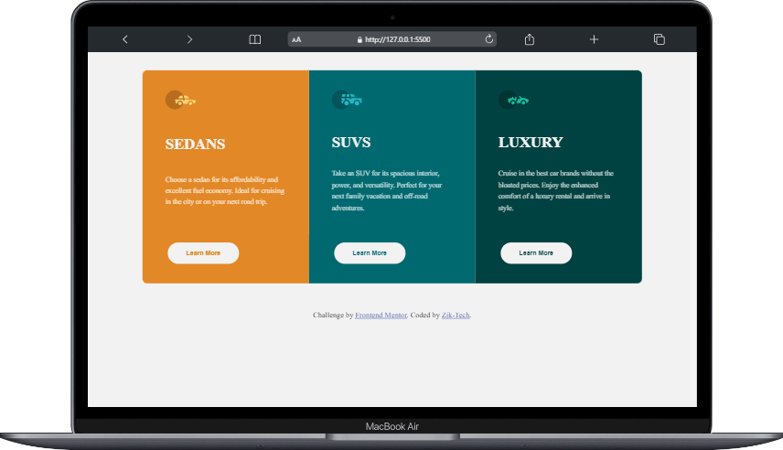
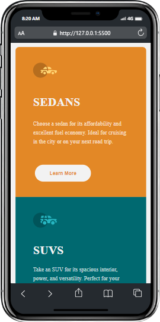

# Frontend Mentor - 3-column preview card component solution

This is a solution to the [3-column preview card component challenge on Frontend Mentor](https://www.frontendmentor.io/challenges/3column-preview-card-component-pH92eAR2-). Frontend Mentor challenges help you improve your coding skills by building realistic projects. 

## Table of contents

- [Overview](#overview)
  - [The challenge](#the-challenge)
  - [Screenshot](#screenshot)
  - [Links](#links)
- [My process](#my-process)
  - [Built with](#built-with)
  - [What I learned](#what-i-learned)
- [Author](#author)


## Overview

### The challenge

Users should be able to:

- View the optimal layout depending on their device's screen size
- See hover states for interactive elements

### Screenshot
- Laptops View

  

- Mobile View

  


### Links

- Solution URL: [Solution](https://github.com/Zik-Tech/3-column-preview-card-component)
- Live Site URL: [Live Site](https://zik-tech.github.io/3-column-preview-card-component/)

## My process

### Built with

- CSS custom properties
- Flexbox
- CSS Grid
- Mobile-first workflow
- Responsive Layout Design


### What I learned

In this Section i learnt more on *Page Layout* and *Responsiveness* using *Flexbox* and *Grid* with *Media queries* and i also mastered css variables 

### A new feature i learnt 

```css
  @media screen and (min-width: 745px) and (max-width:1116px) {
      .one {
          border-radius: 10px 0px 0px 10px;
      }
      .two {
          border-radius: 0 10px 10px 0;
      }
      .three {
          border-radius: 0 0 10px 10px;
      }
  }
```

## Author

- Website - [Zik-Tech](https://www.github.com/Zik-Tech)
- Frontend Mentor - [@Zik-Tech](https://www.frontendmentor.io/profile/Zik-Tech)
- Twitter - [@ZikTech1](https://www.twitter.com/ZikTech1)
